# Will-on-Chain: Decentralized Blockchain Will & Inheritance System

A fully decentralized, trustee-less will and crypto-asset inheritance system built on Ethereum. Owners create wills, deposit multi-asset portfolios (ETH, ERC-20, ERC-721, ERC-1155), assign percentage-based heirs, and rely on time-based liveness detection with zero-knowledge proof verification — all without any centralized authority or trusted third party.


---

## Table of Contents

- [Architecture Overview](#architecture-overview)
- [Smart Contract Inheritance Chain](#smart-contract-inheritance-chain)
- [Will State Machine](#will-state-machine)
- [Core Formulas & Time Constants](#core-formulas--time-constants)
- [Deployment Guide (Remix IDE)](#deployment-guide-remix-ide)
- [Web Application Setup](#web-application-setup)
- [Feature Walkthrough](#feature-walkthrough)
  - [1. Connect Wallet & Enter Contract Address](#1-connect-wallet--enter-contract-address)
  - [2. Dashboard](#2-dashboard)
  - [3. Create Will (4-Step Wizard)](#3-create-will-4-step-wizard)
  - [4. Manage Will](#4-manage-will)
  - [5. Heartbeat & Liveness](#5-heartbeat--liveness)
  - [6. Inheritance Execution](#6-inheritance-execution)
  - [7. Claims (Pull-Based)](#7-claims-pull-based)
  - [8. Test Tokens](#8-test-tokens)
- [ZKP Integration Details](#zkp-integration-details)
- [Backend API Reference](#backend-api-reference)
- [Tech Stack](#tech-stack)

---

## Architecture Overview

```
+---------------------------+       +---------------------------+
|     React.js Frontend     |       |    Node.js Backend API    |
|   (ethers.js v6 + MetaMask)  |       |   (Express + ethers.js)   |
+-------------+-------------+       +-------------+-------------+
              |                                   |
              |   Write Transactions              |  Read-Only Queries
              |   (via MetaMask signer)           |  (via JsonRpcProvider)
              v                                   v
+-------------------------------------------------------------+
|              Ethereum Blockchain (Sepolia / Local)           |
|                                                             |
|  +--------------------+  +--------------------+             |
|  | Groth16Verifier    |  | Groth16Verifier    |             |
|  | (4-signal: Age)    |  | (5-signal: DID)    |             |
|  +--------+-----------+  +--------+-----------+             |
|           |                       |                         |
|           v                       v                         |
|  +-----------------------------------------------+         |
|  |         UnifiedWillManager                     |         |
|  |  (WillTypes -> WillStorage -> HeartbeatMgr     |         |
|  |   -> AssetMgr -> ExecutionMgr -> WillMgr)      |         |
|  +-----------------------------------------------+         |
|                                                             |
|  +------------------+  +------------------+  +------------+ |
|  | TestUSDC (ERC20) |  | CryptoArtNFT(721)|  |GameAssets  | |
|  +------------------+  +------------------+  | (ERC-1155) | |
|                                              +------------+ |
+-------------------------------------------------------------+
```

The frontend handles all **write transactions** through MetaMask. The backend provides **read-only** blockchain queries for dashboard data, event indexing, and pending claim lookups.

---

## Smart Contract Inheritance Chain

The system uses a modular Solidity inheritance chain to stay within EIP-170 bytecode limits:

| Contract | Role | Key Functions |
|----------|------|---------------|
| **WillTypes.sol** | Shared enums, structs, type definitions | `WillState`, `Asset`, `Heir`, `DIDRegistration`, `HeirRotationRequest` |
| **WillStorage.sol** | Storage layout, constants, events | All mappings, time constants, EIP-712 typehash |
| **HeartbeatManager.sol** | Liveness proofs & death confirmation flow | `recordHeartbeat()`, `recordHeartbeatWithDIDProof()`, `detectInactivity()`, `startGracePeriod()`, `finalizeGracePeriod()` |
| **AssetManager.sol** | Multi-asset deposit with auto-approval | `addETHAsset()`, `addERC20Asset()`, `addERC721Asset()`, `addERC1155AssetFungible()`, `addERC1155AssetNFT()` |
| **ExecutionManager.sol** | Batch inheritance distribution & claims | `executeInheritanceBatch()`, `claimETH()`, `claimERC20()`, `sweepUnclaimedETH()` |
| **WillManager.sol** (UnifiedWillManager) | Top-level facade, constructor, will CRUD | `createWill()`, `activateWill()`, `cancelWill()`, `verifyHeirAge()`, `rotateHeirAddress()` |

**Auxiliary Contracts:**

| Contract | Purpose |
|----------|---------|
| **AgeVerifier.sol** | Groth16 verifier for 4-signal age proofs (generated by snarkJS) |
| **Verifier.sol** | Groth16 verifier for 5-signal DID liveness proofs |
| **AgeVerificationSystem.sol** | Wrapper combining age verification logic |
| **LivenessRegistry.sol** | Standalone DID registry (merged into HeartbeatManager) |
| **ERC721FractionalWrapper.sol** | Wraps ERC-721 NFTs into fractional ERC-1155 shares |
| **NFTGovernanceWrapper.sol** | t-of-n threshold multisig for NFT governance |
| **ILivenessVerifier.sol** | Interface for the DID liveness verifier |

---

## Will State Machine

```
  Created ──activate()──> Active ──heartbeat expires──> OwnerInactive
     |                      |                               |
  cancel()              recover()                   +30 days (CONFIRMATION_DELAY)
     |                      |                               |
     v                      v                               v
  Cancelled             Active                        GracePeriod
                                                         |
                                                   +90 days (GRACE_DURATION)
                                                         |
                                                         v
                                                   PendingHeirProof
                                                    |           |
                                              dispute()    all heirs verified
                                                    |           |
                                                    v           v
                                                Disputed   ReadyToExecute
                                                    |           |
                                              resolve/expire   executeBatch()
                                                    |           |
                                                    v           v
                                               (prev state)  Executing ──> Executed
```

**Key State Transitions:**
- **Created -> Active**: Owner calls `activateWill()` after adding heirs (shares must sum to 100%) and depositing assets
- **Active -> OwnerInactive**: Anyone calls `detectInactivity()` when `block.timestamp > lastHeartbeat + heartbeatInterval`
- **OwnerInactive -> GracePeriod**: Anyone calls `startGracePeriod()` after `INACTIVITY_CONFIRMATION_DELAY` (30 days)
- **GracePeriod -> PendingHeirProof**: A registered heir calls `finalizeGracePeriod()` after `GRACE_PERIOD_DURATION` (90 days)
- **PendingHeirProof -> ReadyToExecute**: All heirs submit valid ZKP age proofs via `verifyHeirAge()`
- **ReadyToExecute -> Executing -> Executed**: Anyone calls `executeInheritanceBatch()` to distribute assets

**Recovery**: The owner can call `recoverWill()` from `OwnerInactive` or `GracePeriod` to return to `Active`.

---

## Core Formulas & Time Constants

### Inactivity Detection

An owner is considered inactive when their heartbeat has expired:

```
isInactive(will) = (block.timestamp > will.lastHeartbeat + heartbeatInterval(will))
```

Where:
```
heartbeatInterval(will) = will.heartbeatIntervalOverride > 0
                          ? will.heartbeatIntervalOverride
                          : DEFAULT_HEARTBEAT_INTERVAL (30 days = 2,592,000 seconds)
```

### Total Time Before Execution

The minimum time from the owner's last heartbeat to inheritance execution:

```
T_total = heartbeatInterval + INACTIVITY_CONFIRMATION_DELAY + GRACE_PERIOD_DURATION
        = 30 days + 30 days + 90 days
        = 150 days (minimum, with default heartbeat interval)
```

### Time Constants (from WillStorage.sol)

| Constant | Value | Purpose |
|----------|-------|---------|
| `DEFAULT_HEARTBEAT_INTERVAL` | 30 days | Default time between heartbeats |
| `INACTIVITY_CONFIRMATION_DELAY` | 30 days | Wait after OwnerInactive before grace period |
| `GRACE_PERIOD_DURATION` | 90 days | Grace period for owner recovery |
| `DISPUTE_PERIOD` | 7 days | Time window for dispute resolution |
| `DISPUTE_BOND` | 0.1 ETH | Required bond to raise a dispute |
| `HEIR_PROOF_DEADLINE` | 180 days | Deadline for heirs to submit age proofs |
| `UNCLAIMED_ASSET_DEADLINE` | 365 days | Deadline to claim assets before sweep |
| `AUTO_PUSH_GAS_LIMIT` | 50,000 gas | Gas limit for auto-push transfers |
| `MAX_BATCH_SIZE` | 10 | Maximum heirs processed per batch |

### Heir Share Allocation (Basis Points)

Shares are stored in basis points (0-10000) where 10000 = 100%:

```
sharePercent = sharePercentage / 100

// For divisible assets (ETH, ERC-20):
heirAmount = (totalAssetAmount * heir.sharePercentage) / 10000
```

For example, if an heir has `sharePercentage = 5000` (50%) and the will holds 2 ETH:
```
heirAmount = (2 ETH * 5000) / 10000 = 1 ETH
```

### ZKP Age Verification (Groth16, 4 signals)

The age verification circuit proves a heir is old enough without revealing their exact birthdate:

```
Public Signals: [willId, minimumAge, currentYear, birthdateCommitment]
```

The circuit checks:
```
currentYear - birthYear >= minimumAge
Poseidon(birthYear, birthMonth, birthDay) == birthdateCommitment
```

### DID Liveness Verification (Groth16, 5 signals)

The DID liveness circuit verifies the owner's iden3/Privado credential:

```
Public Signals: [isValid, didHash, expirationDate, revocationNonce, currentTimestamp]
```

Validation checks in the smart contract:
```
pubSignals[0] == 1                              // proof indicates valid
pubSignals[1] == will.ownerDidHash              // DID hash matches registered DID
pubSignals[2] > block.timestamp                 // credential not expired
!usedLivenessNonces[pubSignals[3]]              // nonce not replayed
|pubSignals[4] - block.timestamp| <= 300        // timestamp within 5-minute window
```

---

## Deployment Guide (Remix IDE)

### Prerequisites
- MetaMask wallet with Sepolia ETH (use a [Sepolia faucet](https://sepoliafaucet.com/))
- [Remix IDE](https://remix.ethereum.org/)

### Step 1: Deploy Groth16 Verifiers

1. Open Remix IDE and create two files:
   - `AgeVerifier.sol` (from `Solidity-code/ZKProofs/AgeVerifier.sol`)
   - `Verifier.sol` (from `Solidity-code/ZKProofs/Verifier.sol`)
2. Compile each with Solidity `^0.8.20` and **optimizer enabled (200 runs)**
3. Deploy `AgeVerifier.sol` -> note the deployed address (e.g., `0xAgeVerifierAddr...`)
4. Deploy `Verifier.sol` -> note the deployed address (e.g., `0xLivenessVerifierAddr...`)

### Step 2: Deploy UnifiedWillManager

1. Upload all contract files to Remix in the same folder structure
2. Compile `WillManager.sol` with **optimizer enabled (200 runs)**
3. **Important**: Set gas limit to **30,000,000** in Remix (default 3M is not enough)
4. Deploy with constructor arguments:
   ```
   _heirAgeVerifier: 0xAgeVerifierAddr...
   _livenessVerifier: 0xLivenessVerifierAddr...
   ```
5. Note the deployed `UnifiedWillManager` address

> **Note on EIP-3860**: If deploying on Remix VM (Shanghai+), you may hit the 49,152 byte initcode limit. Use a pre-Shanghai VM (Merge/London) or deploy on Sepolia testnet with optimizer enabled.

### Step 3: Deploy Test Tokens (Optional)

1. Deploy `TestUSDC.sol` — call `faucet()` to get 1000 USDC
2. Deploy `CryptoArtNFT.sol` — call `safeMint(yourAddress, "tokenURI")` to mint NFTs
3. Deploy `GameAssetsNFT.sol` — call `faucet(tokenId, amount)` to get game assets

---

## Web Application Setup

### Prerequisites
- Node.js >= 16
- MetaMask browser extension
- Deployed contract addresses from Remix

### Installation

```bash
cd will-app

# Install all dependencies (root + backend + frontend)
npm run install:all
```

### Running

```bash
# Start backend (port 3001) and frontend (port 3000) concurrently
npm start
```

Or run individually:
```bash
# Backend only
cd backend && node server.js

# Frontend only
cd frontend && npm start
```

### Environment Configuration (Backend)

Create `backend/.env`:
```env
PORT=3001
RPC_URL=https://sepolia.infura.io/v3/YOUR_KEY
```

The backend defaults to `http://127.0.0.1:8545` if no RPC URL is set.

---

## Feature Walkthrough

### 1. Connect Wallet & Enter Contract Address

When you first open the app, you see the landing page with a **Connect MetaMask** button. After connecting, you are prompted to enter the **UnifiedWillManager** contract address that you deployed via Remix IDE.

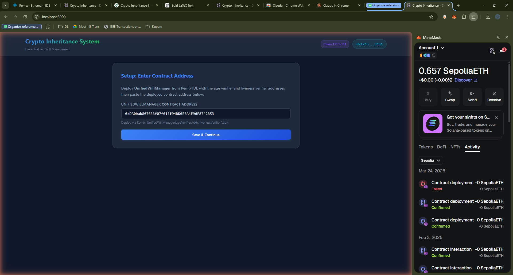

**How it works:**
- Click **Connect MetaMask** to link your wallet
- The app reads your address and chain ID (e.g., Sepolia = 11155111)
- Paste the `UnifiedWillManager` contract address you deployed from Remix
- The address is validated against the pattern `0x[a-fA-F0-9]{40}`
- It is stored in `localStorage` so you don't need to re-enter it on refresh
- Deploy hint: `UnifiedWillManager(ageVerifierAddr, livenessVerifierAddr)`

---

### 2. Dashboard

The Dashboard shows all wills owned by the connected wallet, system constants, and detailed will information.

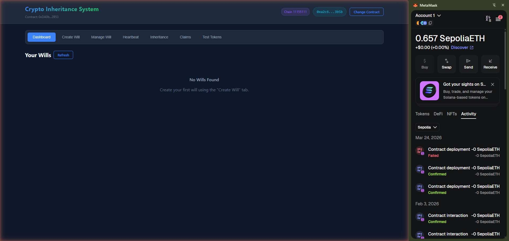

**Parameters displayed:**
- **Your Wills**: Lists all wills by ID with state (Created/Active/Executed etc.)
- **System Constants**: The on-chain time parameters (`DEFAULT_HEARTBEAT_INTERVAL`, `INACTIVITY_CONFIRMATION_DELAY`, `GRACE_PERIOD_DURATION`, `DISPUTE_PERIOD`, `DISPUTE_BOND`)
- **Will Details** (when a will exists): Owner address, asset count, heir count, state, last heartbeat timestamp, heartbeat interval, inactivity status, assets table, heirs table with share percentages

---

### 3. Create Will (4-Step Wizard)

The Create Will tab guides you through a **4-step wizard** with a visual progress indicator.

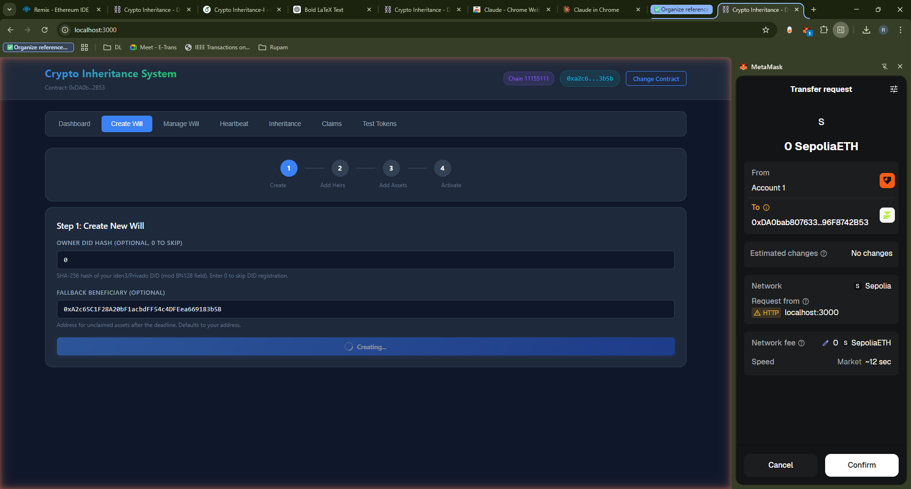

#### Step 1: Create New Will

**Parameters:**
| Field | Type | Description | Example |
|-------|------|-------------|---------|
| Owner DID Hash | `uint256` | SHA-256 hash of your iden3/Privado DID identifier, modulo the BN128 scalar field. Enter `0` to skip DID registration. | `0` or `123456789...` |
| Fallback Beneficiary | `address` | Address that receives unclaimed assets after `UNCLAIMED_ASSET_DEADLINE` (365 days). Leave empty to default to your own address. | `0x742d35Cc...` |

**What happens on-chain:** Calls `createWill(didHash, fallbackBeneficiary)` which initializes a new `Will` struct in state `Created`, assigns a `willId`, sets `createdAt = block.timestamp`, and emits `WillCreated(owner, willId)`.

#### Step 2: Add Heirs

**Parameters:**
| Field | Type | Description | Example |
|-------|------|-------------|---------|
| Heir Address | `address` | Ethereum address of the heir | `0xABC...` |
| Share Percentage | `float` | Percentage of divisible assets (0.01-100). **All heirs must total exactly 100%.** Converted to basis points internally: `shareBps = percentage * 100` | `50` (= 5000 bps) |
| Minimum Age | `uint8` | Minimum age required for ZKP verification (0-100). If 0, no age check needed. | `18` |
| Birthdate Commitment | `uint256` | Poseidon hash of `(birthYear, birthMonth, birthDay)`. Used by the ZKP circuit to verify age without revealing birthdate. Enter `0` if no age check. | `8732451...` |
| Vesting Period | `uint256` | Seconds after execution starts before heir can receive assets. `0` = immediate. | `2592000` (30 days) |

**Formula:** Shares are in basis points. The UI validates:
```
totalShares = sum(heir.sharePercentage for all heirs)
// Must equal 10000 (100%) to activate
```

#### Step 3: Deposit Assets

**Asset Types:**
| Asset Type | Parameters | On-Chain Function |
|------------|-----------|-------------------|
| **ETH** | Amount (e.g., `0.5`) | `addETHAsset(willId, {value: parseEther(amount)})` |
| **ERC-20** | Token contract address + amount | Auto-calls `token.approve(willContract, amount)` then `addERC20Asset(willId, tokenAddr, amount)` |
| **ERC-721** | NFT contract + Token ID + Specific Heir address | Auto-calls `nft.approve(willContract, tokenId)` then `addERC721Asset(willId, nftAddr, tokenId, specificHeir)` |
| **ERC-1155** | Token contract + Token ID + Amount + Specific Heir (if amount=1) | Auto-calls `token.setApprovalForAll(willContract, true)` then `addERC1155AssetFungible()` or `addERC1155AssetNFT()` |

**Divisible vs. Indivisible:**
- ETH and ERC-20 are **divisible** — split by heir percentage: `heirAmount = (total * share) / 10000`
- ERC-721 NFTs are **indivisible** — assigned to a `specificHeir` address (1:1)
- ERC-1155 with amount > 1 is **divisible** (fungible tokens); amount = 1 is **indivisible** (NFT)

#### Step 4: Activate Will

Displays a summary (heirs count, total shares, assets deposited) and an activation button. **Activation locks the will** — no more heirs or assets can be added. The heartbeat timer starts immediately with `lastHeartbeat = block.timestamp`.

---

### 4. Manage Will

The Manage Will tab provides owner-side will administration functions.

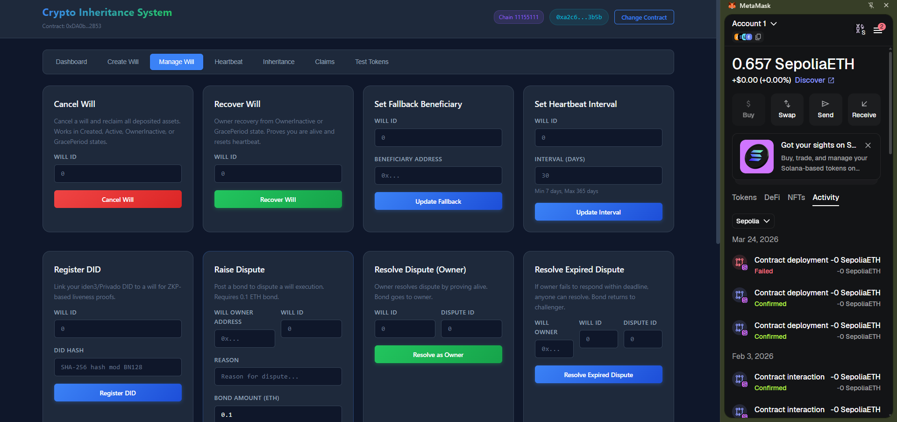
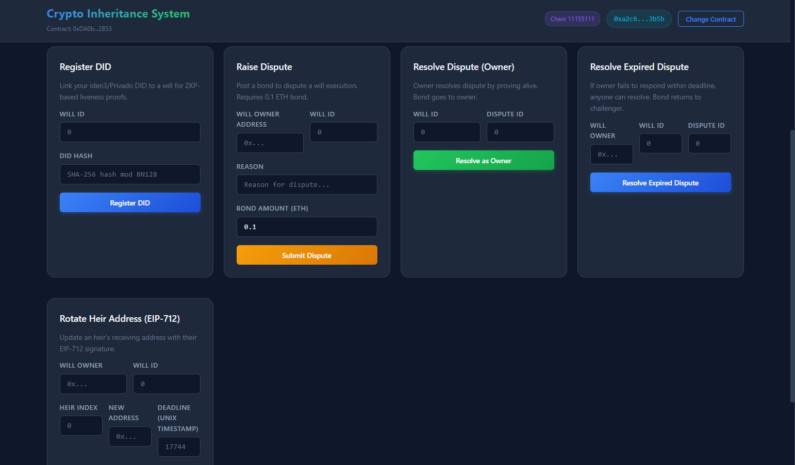
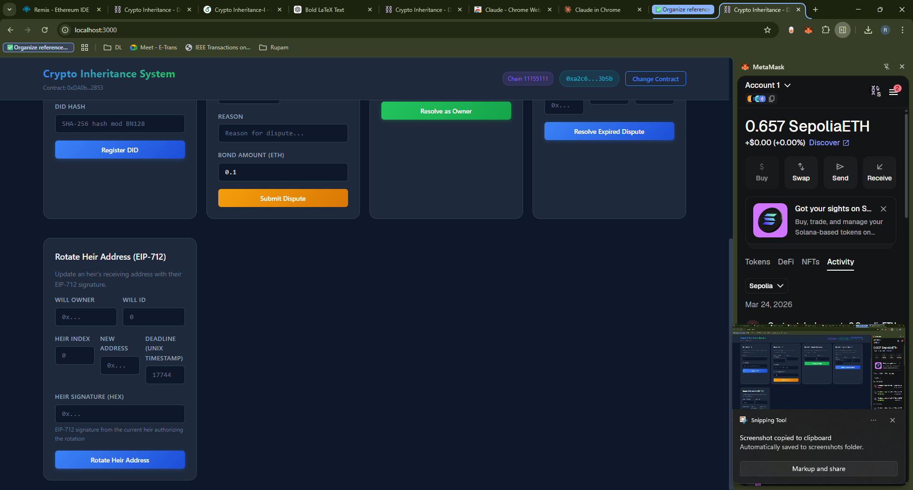

#### Cancel Will
| Parameter | Description |
|-----------|-------------|
| Will ID | The numeric ID of the will to cancel |

Calls `cancelWill(willId)`. Only works from `Created` or `Active` states. Returns deposited ETH to the owner.

#### Recover Will
| Parameter | Description |
|-----------|-------------|
| Will ID | The will to recover |

Calls `recoverWill(willId)`. Owner proves they're alive by calling this from `OwnerInactive` or `GracePeriod` state. Resets the will back to `Active` and updates `lastHeartbeat`.

#### Set Fallback Beneficiary
| Parameter | Description |
|-----------|-------------|
| Will ID | Target will |
| Beneficiary Address | New fallback address for unclaimed assets |

#### Set Heartbeat Interval
| Parameter | Description |
|-----------|-------------|
| Will ID | Target will |
| Interval (days) | Custom heartbeat interval. **Min: 7 days, Max: 365 days.** Converted to seconds: `interval * 86400` |

**Formula:**
```
newInterval = inputDays * 86400  // convert days to seconds
require(newInterval >= 604800 && newInterval <= 31536000)  // 7-365 days range
```

#### Register DID
| Parameter | Description |
|-----------|-------------|
| Will ID | Target will |
| DID Hash | SHA-256 hash of your iden3/Privado DID string, modulo the BN128 scalar field `r` |

**How to compute DID Hash:**
```
didHash = SHA256("did:iden3:polygon:mumbai:YOUR_DID_STRING") mod r
// Where r = 21888242871839275222246405745257275088548364400416034343698204186575808495617
```

Registers the DID in the on-chain `didRecords` mapping and links it to the will, enabling DID-based ZKP heartbeats.

#### Raise Dispute
| Parameter | Description |
|-----------|-------------|
| Will Owner | Address of the will owner |
| Will ID | Target will |
| Reason | Text description of the dispute |
| Bond Amount (ETH) | Must be >= `DISPUTE_BOND` (0.1 ETH) |

Calls `disputeExecution{value: bond}(owner, willId, reason)`. Pauses the will into `Disputed` state. The dispute must be resolved within `DISPUTE_PERIOD` (7 days).

#### Resolve Dispute (Owner)
| Parameter | Description |
|-----------|-------------|
| Will ID | Target will (caller must be owner) |
| Dispute ID | The numeric dispute ID |

Owner resolves the dispute. Will returns to `Active` state.

#### Resolve Expired Dispute
| Parameter | Description |
|-----------|-------------|
| Will Owner | Address of the will owner |
| Will ID | Target will |
| Dispute ID | The expired dispute ID |

Anyone can call after `DISPUTE_PERIOD` (7 days) expires. Returns the will to its pre-dispute state.

#### Rotate Heir Address (EIP-712)
| Parameter | Description |
|-----------|-------------|
| Will Owner | Address of the will owner |
| Will ID | Target will |
| Heir Index | Index of the heir to update (0-based) |
| New Address | New Ethereum address for the heir |
| Deadline | Unix timestamp after which the signature expires |
| EIP-712 Signature | Signed message from the **current heir address** authorizing the rotation |

**EIP-712 Typed Data Structure:**
```
HeirRotation(
  address owner,
  uint256 willId,
  uint256 heirIndex,
  address oldAddress,
  address newAddress,
  uint256 nonce,
  uint256 deadline
)
```

The heir signs this typed data with their current private key. The contract verifies the signature, checks the nonce and deadline, and updates the heir address. This allows heirs to rotate to a new wallet without exposing personal information on-chain.

---

### 5. Heartbeat & Liveness

The Heartbeat tab manages the owner liveness system — the core mechanism that replaces traditional trustees.

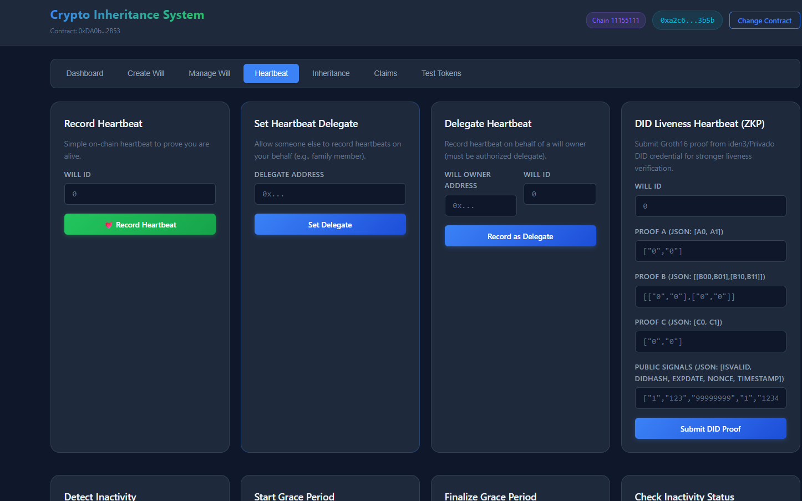
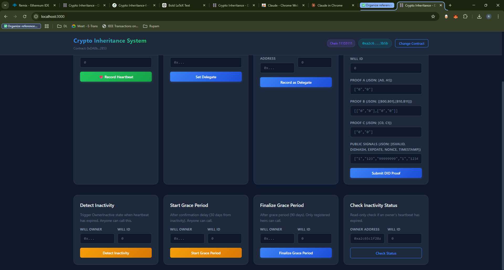

#### Record Heartbeat (Simple)
| Parameter | Description |
|-----------|-------------|
| Will ID | The active will to heartbeat |

Calls `recordHeartbeat(willId)`. Sets `will.lastHeartbeat = block.timestamp`. This is the simplest liveness proof — just a transaction from the owner's wallet.

**When to heartbeat:**
```
timeRemaining = (lastHeartbeat + heartbeatInterval) - block.timestamp
// Heartbeat before timeRemaining reaches 0 to prevent OwnerInactive trigger
```

#### Set Heartbeat Delegate
| Parameter | Description |
|-----------|-------------|
| Delegate Address | Address authorized to heartbeat on your behalf |

Calls `setHeartbeatDelegate(delegate)`. Use case: A family member who can heartbeat if the owner is temporarily unavailable (e.g., hospitalized). The delegate can record heartbeats for ALL of the owner's wills.

#### Delegate Heartbeat
| Parameter | Description |
|-----------|-------------|
| Will Owner Address | The will owner's address |
| Will ID | The will to heartbeat |

Calls `recordHeartbeatByDelegate(owner, willId)`. Only works if `msg.sender == heartbeatDelegates[owner]`.

#### DID Liveness Heartbeat (ZKP)

This is the **strongest form of liveness proof**, using a Groth16 zero-knowledge proof from the owner's iden3/Privado DID credential.

| Parameter | Type | Description | Example Value |
|-----------|------|-------------|---------------|
| Will ID | `uint256` | The active will | `0` |
| Proof A | JSON `[a0, a1]` | First element of the Groth16 proof (2 field elements) | `["0x1234...", "0x5678..."]` |
| Proof B | JSON `[[b00,b01],[b10,b11]]` | Second element (2x2 matrix of field elements) | `[["0x...","0x..."],["0x...","0x..."]]` |
| Proof C | JSON `[c0, c1]` | Third element (2 field elements) | `["0x...", "0x..."]` |
| Public Signals | JSON `[isValid, didHash, expDate, nonce, timestamp]` | 5 public signals | `["1","123456","1735689600","1","1711234567"]` |

**Public Signals Explained:**

| Index | Signal | Type | Description |
|-------|--------|------|-------------|
| 0 | `isValid` | `uint256` | Must be `1` — the proof asserts the DID credential is valid |
| 1 | `didHash` | `uint256` | Must match `will.ownerDidHash` — the SHA-256 hash of the DID |
| 2 | `expirationDate` | `uint256` | Unix timestamp of credential expiration. Must be > `block.timestamp` |
| 3 | `revocationNonce` | `uint256` | One-time nonce to prevent replay. Each nonce can only be used once |
| 4 | `currentTimestamp` | `uint256` | Must be within 300 seconds (5 minutes) of `block.timestamp` |

**Validation Formula (on-chain):**
```
require(pubSignals[0] == 1)                                    // valid proof
require(pubSignals[1] == will.ownerDidHash)                    // DID matches
require(pubSignals[2] > block.timestamp)                       // not expired
require(!usedLivenessNonces[pubSignals[3]])                    // fresh nonce
require(|pubSignals[4] - block.timestamp| <= 300)              // 5-min window
require(livenessVerifier.verifyProof(pA, pB, pC, pubSignals))  // Groth16 valid
```

**Where to get these values:** Generate them using the iden3/Privado SDK or snarkJS with the corresponding circom circuit. The proof is generated off-chain and submitted on-chain for verification.

#### Detect Inactivity
| Parameter | Description |
|-----------|-------------|
| Will Owner | Address of the will owner |
| Will ID | The will to check |

**Anyone** can call `detectInactivity(owner, willId)`. Transitions from `Active` -> `OwnerInactive` if:
```
block.timestamp > will.lastHeartbeat + heartbeatInterval(will)
```

#### Start Grace Period
| Parameter | Description |
|-----------|-------------|
| Will Owner | Address of the will owner |
| Will ID | The will |

**Anyone** can call after `INACTIVITY_CONFIRMATION_DELAY` (30 days). Transitions `OwnerInactive` -> `GracePeriod`:
```
require(block.timestamp >= will.inactivityDetectedAt + INACTIVITY_CONFIRMATION_DELAY)
```

#### Finalize Grace Period
| Parameter | Description |
|-----------|-------------|
| Will Owner | Address of the will owner |
| Will ID | The will |

Only a **registered heir** can call after `GRACE_PERIOD_DURATION` (90 days). Transitions `GracePeriod` -> `PendingHeirProof`:
```
require(block.timestamp >= will.gracePeriodStartedAt + GRACE_PERIOD_DURATION)
```

#### Check Inactivity Status
| Parameter | Description |
|-----------|-------------|
| Owner Address | Address to check (defaults to connected wallet) |
| Will ID | The will to check |

Read-only call to `isOwnerInactive(owner, willId)`. Returns `true` if the heartbeat has expired, `false` if the owner is still active.

---

### 6. Inheritance Execution

After the grace period is finalized, heirs must verify their age, then the inheritance is executed.

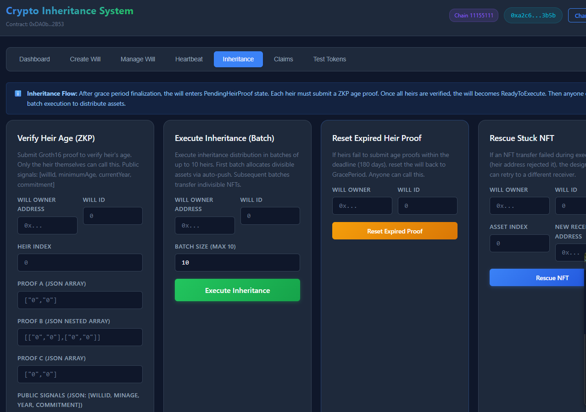
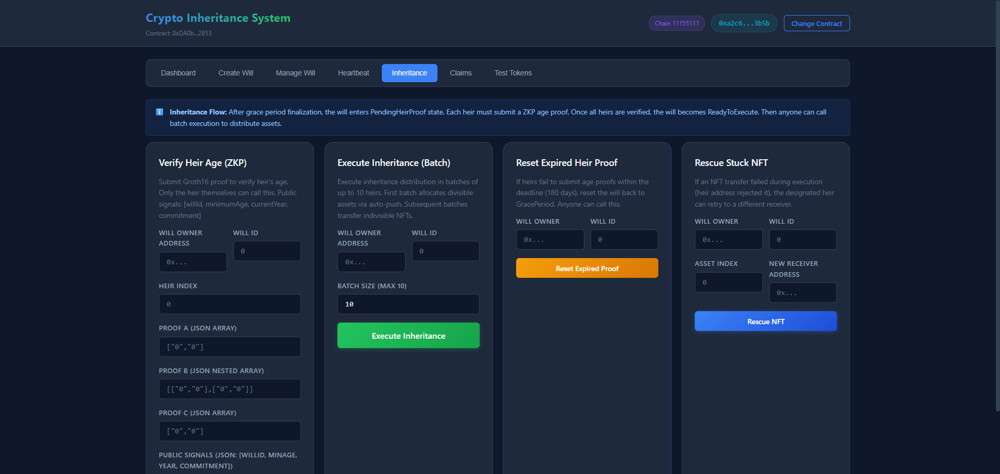

#### Verify Heir Age (ZKP)

Each heir must submit a Groth16 proof to verify they meet the minimum age requirement.

| Parameter | Type | Description | Example |
|-----------|------|-------------|---------|
| Will Owner Address | `address` | The will creator's address | `0x742d...` |
| Will ID | `uint256` | The will ID | `0` |
| Heir Index | `uint256` | 0-based index of the heir | `0` |
| Proof A | JSON `[a0, a1]` | Groth16 proof element A | `["0x...","0x..."]` |
| Proof B | JSON `[[b00,b01],[b10,b11]]` | Groth16 proof element B | `[["0x...","0x..."],["0x...","0x..."]]` |
| Proof C | JSON `[c0, c1]` | Groth16 proof element C | `["0x...","0x..."]` |
| Public Signals | JSON `[willId, minAge, year, commitment]` | 4 public signals | `["0","18","2026","87324..."]` |

**Public Signals for Age Verification:**

| Index | Signal | Description |
|-------|--------|-------------|
| 0 | `willId` | Must match the will being claimed |
| 1 | `minimumAge` | Must match the heir's `minimumAge` set during will creation |
| 2 | `currentYear` | The current year (e.g., `2026`) |
| 3 | `birthdateCommitment` | Must match the Poseidon hash stored for this heir: `Poseidon(birthYear, birthMonth, birthDay)` |

**Circuit Logic:**
```
// The ZK circuit proves (without revealing birthdate):
currentYear - birthYear >= minimumAge
Poseidon(birthYear, birthMonth, birthDay) == birthdateCommitment
```

#### Execute Inheritance (Batch)

| Parameter | Description |
|-----------|-------------|
| Will Owner Address | The will creator |
| Will ID | The will to execute |
| Batch Size | Number of heirs to process per transaction (max 10) |

Calls `executeInheritanceBatch(owner, willId, batchSize)`. The execution uses a **hybrid auto-push with pull-based fallback**:

1. **Divisible assets (ETH, ERC-20, ERC-1155 fungible):** The contract calculates each heir's share and attempts an auto-push transfer with a gas limit of 50,000. If the push fails (recipient is a contract that reverts), the amount is stored in `pendingETH`/`pendingERC20`/`pendingERC1155` for pull-based claiming.

2. **Indivisible assets (ERC-721, ERC-1155 NFT):** Transferred directly to the `specificHeir`. If the transfer fails, the asset is marked as "stuck" and can be rescued later.

**Distribution Formula:**
```
// For each divisible asset and each heir:
heirAmount = (asset.amount * heir.sharePercentage) / 10000

// Auto-push attempt:
(success, ) = heir.heirAddress.call{value: heirAmount, gas: AUTO_PUSH_GAS_LIMIT}("")
if (!success) {
    pendingETH[heir.heirAddress] += heirAmount;  // fallback to pull
}
```

#### Reset Expired Heir Proof

| Parameter | Description |
|-----------|-------------|
| Will Owner | The will owner |
| Will ID | Target will |

If heirs fail to submit age proofs within `HEIR_PROOF_DEADLINE` (180 days), anyone can call this to reset the will back to `GracePeriod`.

#### Rescue Stuck NFT

| Parameter | Description |
|-----------|-------------|
| Will Owner | The will owner |
| Will ID | Target will |
| Asset Index | Index of the stuck NFT asset |
| New Receiver Address | Alternative address to send the NFT to |

If an NFT transfer failed during execution (e.g., the heir's address is a contract that doesn't support `onERC721Received`), the designated heir can retry the transfer to a different address.

---

### 7. Claims (Pull-Based)

After inheritance execution, heirs claim their allocated assets.

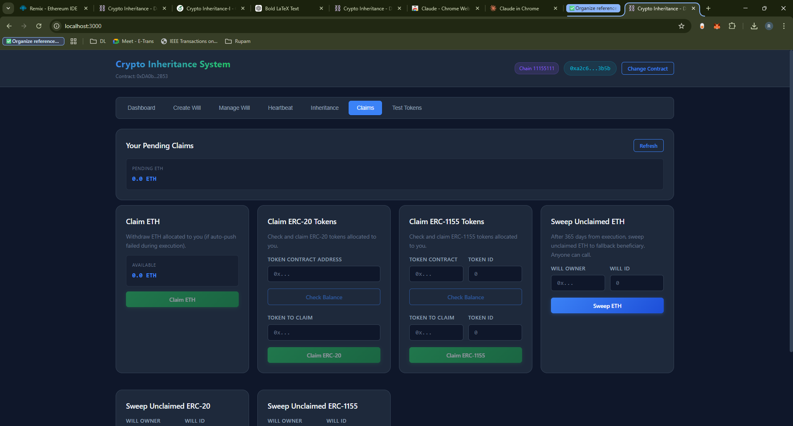
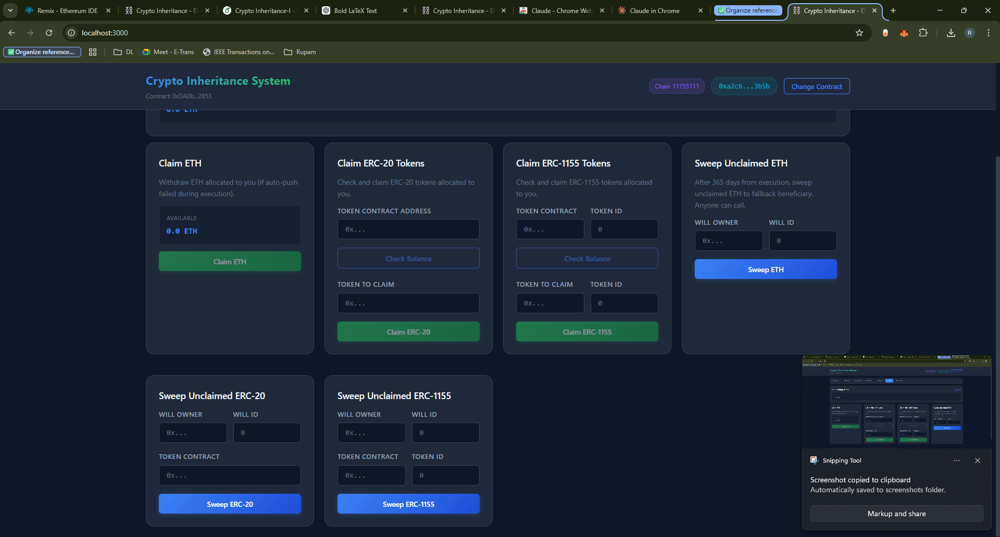
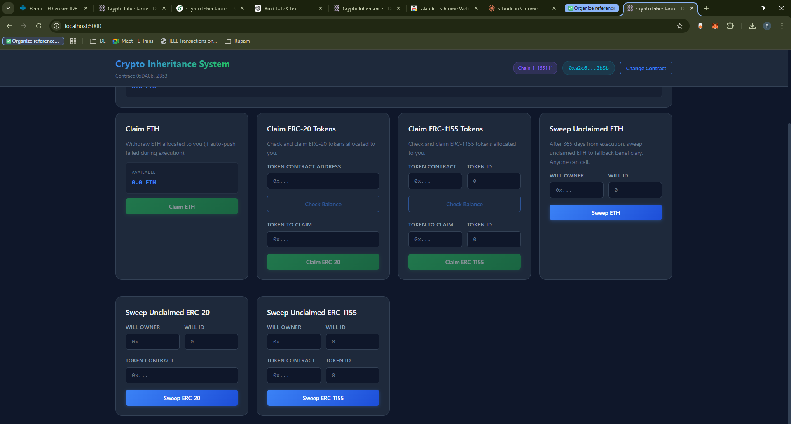

#### Your Pending Claims

Displays the connected wallet's pending ETH balance (auto-loaded on page visit):
```
pendingETH = contract.pendingETH(walletAddress)
// Displayed as: "X.XX ETH"
```

#### Claim ETH
No parameters — calls `claimETH()`. Transfers all `pendingETH[msg.sender]` to the caller.

#### Claim ERC-20 Tokens
| Parameter | Description |
|-----------|-------------|
| Token Contract Address | The ERC-20 token to claim |
| Token to Claim | Same address (for the transaction) |

Calls `claimERC20(tokenAddress)`. Transfers all `pendingERC20[msg.sender][token]`.

#### Claim ERC-1155 Tokens
| Parameter | Description |
|-----------|-------------|
| Token Contract | The ERC-1155 contract address |
| Token ID | The specific token ID to claim |

Calls `claimERC1155(tokenAddress, tokenId)`. Transfers `pendingERC1155[msg.sender][token][tokenId]`.

#### Sweep Unclaimed ETH / ERC-20 / ERC-1155
| Parameter | Description |
|-----------|-------------|
| Will Owner | Original will creator |
| Will ID | Target will |
| Token Contract | (for ERC-20/ERC-1155) |
| Token ID | (for ERC-1155 only) |

After `UNCLAIMED_ASSET_DEADLINE` (365 days from execution), the **fallback beneficiary** can sweep any unclaimed assets. This prevents funds from being locked forever if an heir never claims.

---

### 8. Test Tokens

The Test Tokens tab provides faucets and utilities for testing with mock tokens.

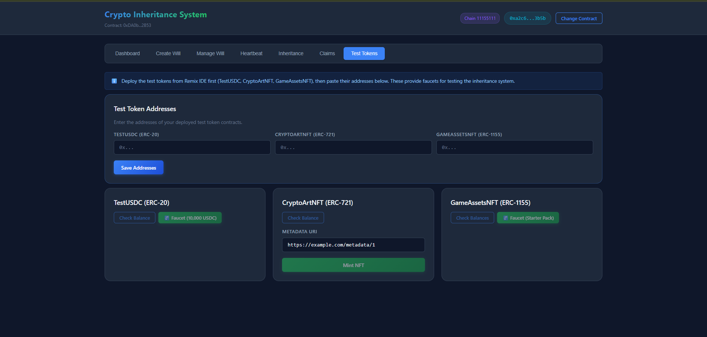

#### Setup
1. Deploy test token contracts from Remix IDE
2. Paste the deployed addresses in the **Test Token Addresses** section
3. Click **Save Addresses** — addresses persist in `localStorage`

#### TestUSDC (ERC-20)
- **Faucet**: Call `faucet()` to mint 1,000 USDC (18 decimals) to your wallet
- **Balance Check**: Displays your current TestUSDC balance

#### CryptoArtNFT (ERC-721)
- **Mint**: Enter a metadata URI and call `safeMint(yourAddress, tokenURI)` to mint a unique NFT
- Each mint increments the token ID automatically

#### GameAssetsNFT (ERC-1155)
- **Faucet**: Enter Token ID and Amount, calls `faucet(tokenId, amount)` to mint semi-fungible game assets
- **Balance Check**: Enter Token ID to check your balance of a specific token

---

## ZKP Integration Details

### Groth16 Proof Structure

Both verifiers use the same Groth16 proof format from snarkJS/iden3:

```
Proof = {
  pi_a: [a0, a1],              // 2 field elements (G1 point)
  pi_b: [[b00, b01], [b10, b11]],  // 2x2 field elements (G2 point)
  pi_c: [c0, c1]               // 2 field elements (G1 point)
}
```

All values are `uint256` strings representing BN128 curve points.

### Age Verifier (4-signal circuit)

**File:** `Solidity-code/ZKProofs/AgeVerifier.sol`

```
verifyProof(
  uint[2] pA,        // proof.pi_a
  uint[2][2] pB,     // proof.pi_b
  uint[2] pC,        // proof.pi_c
  uint[4] pubSignals // [willId, minimumAge, currentYear, birthdateCommitment]
) returns (bool)
```

### Liveness Verifier (5-signal circuit)

**File:** `Solidity-code/ZKProofs/Verifier.sol`

```
verifyProof(
  uint[2] pA,        // proof.pi_a
  uint[2][2] pB,     // proof.pi_b
  uint[2] pC,        // proof.pi_c
  uint[5] pubSignals // [isValid, didHash, expirationDate, revocationNonce, timestamp]
) returns (bool)
```

### Generating Proofs (Off-chain)

Proofs are generated using **snarkJS** with the corresponding circom circuits:

```bash
# Generate age proof
snarkjs groth16 fullprove input.json age_circuit.wasm age_circuit_final.zkey proof.json public.json

# Generate liveness proof (via iden3/Privado SDK)
# The SDK handles credential fetching, circuit compilation, and proof generation
```

The JSON output from snarkJS maps directly to the UI fields:
- `proof.json` -> `pi_a`, `pi_b`, `pi_c` fields
- `public.json` -> Public Signals field

---

## Backend API Reference

The Express.js backend runs on port 3001 and provides read-only blockchain queries.

| Endpoint | Method | Description |
|----------|--------|-------------|
| `/api/health` | GET | Health check, returns `{status: "ok", timestamp}` |
| `/api/wills/:contract/:owner` | GET | Get all wills for an owner |
| `/api/wills/:contract/:owner/:willId` | GET | Get detailed will info (assets, heirs, state) |
| `/api/claims/:contract/:address` | GET | Check pending ETH/ERC20 claims for an address |
| `/api/constants/:contract` | GET | Get system constants from the contract |
| `/api/inactivity/:contract/:owner/:willId` | GET | Check if owner is inactive |
| `/api/events/:contract` | GET | Get recent events (last N blocks) |

**Query Parameters:** All endpoints accept `?rpc=RPC_URL` to override the default provider.

---

## Tech Stack

| Layer | Technology |
|-------|------------|
| **Smart Contracts** | Solidity ^0.8.20, OpenZeppelin |
| **ZKP** | Groth16 (snarkJS/iden3), Circom circuits |
| **Frontend** | React.js 18, ethers.js v6, CSS custom properties |
| **Backend** | Node.js, Express.js 4, ethers.js v6 |
| **Wallet** | MetaMask (EIP-1193 provider) |
| **Testnet** | Ethereum Sepolia |
| **Standards** | ERC-20, ERC-721, ERC-1155, EIP-712, EIP-170, EIP-3860 |

---

## Project Structure

```
will-on-chain/
├── Solidity-code/
│   ├── WillTypes.sol              # Shared types and enums
│   ├── WillStorage.sol            # Storage layout and constants
│   ├── HeartbeatManager.sol       # Liveness proofs and death confirmation
│   ├── AssetManager.sol           # Multi-asset deposit management
│   ├── ExecutionManager.sol       # Batch inheritance distribution
│   ├── WillManager.sol            # Top-level unified contract
│   ├── ILivenessVerifier.sol      # DID verifier interface
│   ├── ERC721FractionalWrapper.sol # NFT fractionalization
│   ├── NFTGovernanceWrapper.sol   # t-of-n NFT multisig
│   ├── timestamp.sol              # Timestamp utility
│   ├── TestTokens/
│   │   ├── TestUSDC.sol           # Mock ERC-20 with faucet
│   │   ├── CryptoArtNFT.sol       # Mock ERC-721 with mint
│   │   ├── GameAssetsNFT.sol      # Mock ERC-1155 with faucet
│   │   └── MockVerifier.sol       # Mock verifier for testing
│   └── ZKProofs/
│       ├── AgeVerifier.sol        # Groth16 4-signal age verifier
│       ├── Verifier.sol           # Groth16 5-signal liveness verifier
│       ├── AgeVerificationSystem.sol
│       └── LivenessRegistry.sol
├── will-app/
│   ├── package.json               # Root package with install/start scripts
│   ├── backend/
│   │   ├── server.js              # Express API for read-only queries
│   │   ├── package.json
│   │   └── .env.example
│   └── frontend/
│       ├── package.json
│       ├── public/index.html
│       └── src/
│           ├── App.js             # Main component with 7 tabs
│           ├── index.js            # React entry point
│           ├── index.css           # Dark theme CSS
│           ├── contracts/abis.js   # All contract ABIs
│           ├── utils/web3.js       # ethers.js helpers
│           └── pages/
│               ├── Dashboard.js
│               ├── CreateWill.js
│               ├── ManageWill.js
│               ├── HeartbeatPage.js
│               ├── InheritancePage.js
│               ├── ClaimsPage.js
│               └── TestTokens.js
├── screenshots/                    # Application screenshots
└── README.md
```

---

## License

This project is part of an academic research work. Smart contracts use MIT and GPL-3.0 licenses (Groth16 verifiers generated by snarkJS are GPL-3.0).
